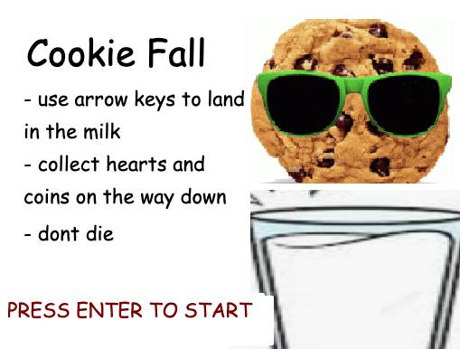

# Cookie Fall 

This is a game written to run on the Gameboy Advance. It was developed by me for a project we had in my Computer Organization class at Georgia Tech to learn C programming with hardware acceleration techniques. We used an emulation framework called Mednafen to run it. 

## What I learned 
I learned how to write efficient, organized code in C during this project. I also learned how to use DMA (Direct Memory Access) controllers to accelerate tasks that would otherwise take a long time for the CPU to complete. In this case, the task was writing to the graphics buffer to make things show up on screen. If we used the CPU to do this, it would manually have to visit each pixel in the graphics buffer and update the location. Games require real time graphics, so the designers of the GBA included DMA units in order to offload these types of tasks and reduce latency. 

## How to build
`make med` 

## Game Description

Oh no! Looks like you turned into a cookie. To stay alive, you must fall into the milk. If you miss the milk, 
you lose 1 health (Calcium deficiency is a silent killer). Each time you fall into the milk, you gain 1 point. 
Collecting coins gets you 2 points. Get at least 3 points to avoid being a dissaPOINTment...

## CONTROLS
- LEFT: move left
- RIGHT: move right
- DOWN: fall faster  
- SELECT: restart game

